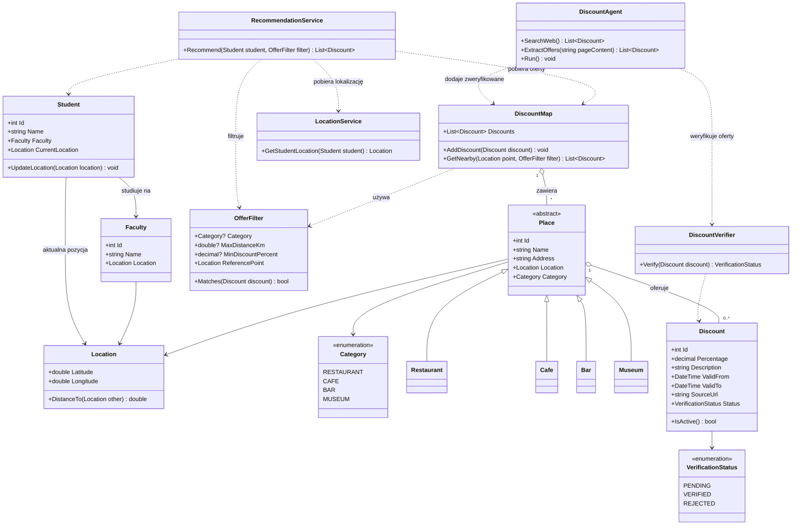

```mermaid
classDiagram
    direction TB

    class Location {
        +double Latitude
        +double Longitude
        +DistanceTo(Location other) double
    }

    class Faculty {
        +int Id
        +string Name
        +Location Location
    }

    class Student {
        +int Id
        +string Name
        +Faculty Faculty
        +Location CurrentLocation
        +UpdateLocation(Location location) void
    }

    class Category {
        <<enumeration>>
        RESTAURANT
        CAFE
        BAR
        MUSEUM
    }

    class Place {
        <<abstract>>
        +int Id
        +string Name
        +string Address
        +Location Location
        +Category Category
    }

    class Restaurant
    class Cafe
    class Bar
    class Museum

    class VerificationStatus {
        <<enumeration>>
        PENDING
        VERIFIED
        REJECTED
    }

    class Discount {
        +int Id
        +decimal Percentage
        +string Description
        +DateTime ValidFrom
        +DateTime ValidTo
        +string SourceUrl
        +VerificationStatus Status
        +IsActive() bool
    }

    class OfferFilter {
        +Category? Category
        +double? MaxDistanceKm
        +decimal? MinDiscountPercent
        +Location ReferencePoint
        +Matches(Discount discount) bool
    }

    class DiscountMap {
        +List~Discount~ Discounts
        +AddDiscount(Discount discount) void
        +GetNearby(Location point, OfferFilter filter) List~Discount~
    }

    class RecommendationService {
        +Recommend(Student student, OfferFilter filter) List~Discount~
    }

    class LocationService {
        +GetStudentLocation(Student student) Location
    }

    class DiscountAgent {
        +SearchWeb() List~Discount~
        +ExtractOffers(string pageContent) List~Discount~
        +Run() void
    }

    class DiscountVerifier {
        +Verify(Discount discount) VerificationStatus
    }

    Place <|-- Restaurant
    Place <|-- Cafe
    Place <|-- Bar
    Place <|-- Museum

    Place --> Category
    Place --> Location
    Faculty --> Location
    Student --> Faculty : studiuje na
    Student --> Location : aktualna pozycja

    Place "1" o-- "0..*" Discount : oferuje
    Discount --> VerificationStatus

    DiscountMap "1" o-- "*" Place : zawiera
    DiscountMap ..> OfferFilter : używa

    RecommendationService ..> DiscountMap : pobiera oferty
    RecommendationService ..> LocationService : pobiera lokalizację
    RecommendationService ..> OfferFilter : filtruje
    RecommendationService ..> Student

    DiscountAgent ..> DiscountVerifier : weryfikuje oferty
    DiscountAgent ..> DiscountMap : dodaje zweryfikowane
    DiscountVerifier ..> Discount
```

