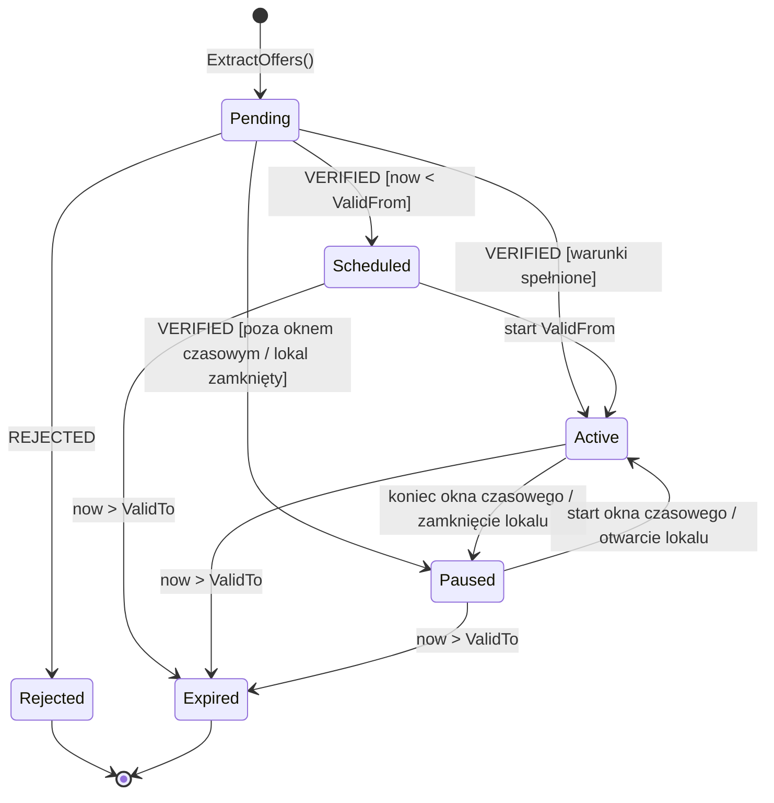

```mermaid
stateDiagram-v2
    [*] --> Pending : ExtractOffers()
    Pending --> Rejected : REJECTED
    Pending --> Scheduled : VERIFIED [now < ValidFrom]
    Pending --> Active : VERIFIED [warunki spełnione]
    Pending --> Paused : VERIFIED [poza oknem czasowym / lokal zamknięty]

    Scheduled --> Active : start ValidFrom
    Active --> Paused : koniec okna czasowego / zamknięcie lokalu
    Paused --> Active : start okna czasowego / otwarcie lokalu

    Scheduled --> Expired : now > ValidTo
    Active --> Expired : now > ValidTo
    Paused --> Expired : now > ValidTo

    Rejected --> [*]
    Expired --> [*]
```
