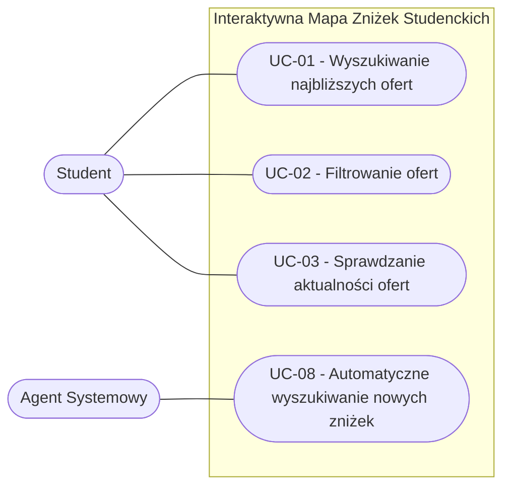

```mermaid
flowchart LR
    Student([Student])
    Agent([Agent Systemowy])

    subgraph System ["Interaktywna Mapa Zniżek Studenckich"]
        direction TB

        UC1([UC-01 - Wyszukiwanie najbliższych ofert])
        UC2([UC-02 - Filtrowanie ofert])
        UC3([UC-03 - Sprawdzanie aktualności ofert])
        UC8([UC-08 - Automatyczne wyszukiwanie nowych zniżek])
    end

    Student --- UC1
    Student --- UC2
    Student --- UC3

    Agent --- UC8
```
